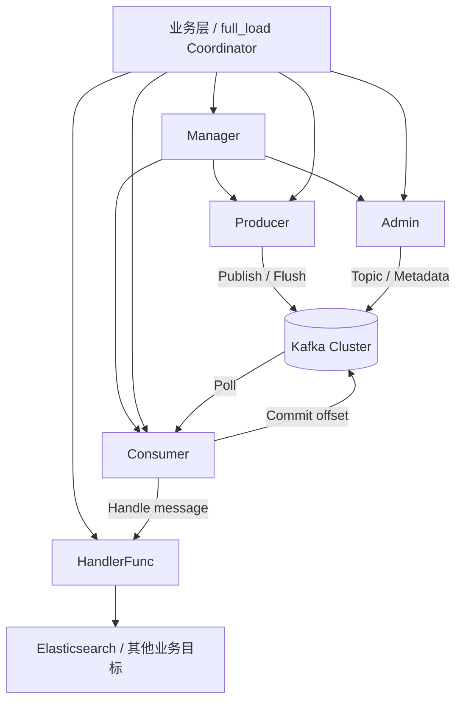

# new_kafka 设计说明

## 设计目标

`internal/pkg/new_kafka` 是对当前 Kafka 使用方式的一次重新抽象，核心目标有 4 个：

1. **职责清晰**：把 `Admin`、`Producer`、`Consumer`、资源管理拆开，避免一个 `Client` 同时承担所有职责。
2. **与业务解耦**：Kafka 层只负责“发、收、提交、管理 topic”，不直接依赖 ES、PG 等业务对象。
3. **生命周期统一**：通过 `Manager` 统一创建和关闭 Kafka 资源，减少泄漏和关闭顺序混乱的问题。
4. **便于调度**：支持 `Producer` 背压控制、`Consumer` 批量提交 offset，适合 `full_load` 这类长链路任务。

## 模块划分

- `config.go`
  - 负责 Kafka 基础配置读取与校验
- `manager.go`
  - 负责创建 `Producer`、`Consumer`、`Admin`
  - 统一管理资源关闭
- `producer.go`
  - 负责消息发送、背压控制、发送统计、flush
- `consumer.go`
  - 负责消费循环、handler 调用、offset 提交
- `admin.go`
  - 负责 topic 管理、metadata 获取、等待 topic 就绪
- `types.go`
  - 定义 `Message`、`ProducerOptions`、`ConsumerOptions`、`TopicSpec` 等公共类型

## 设计思路

旧封装的问题主要是 Kafka 层和业务层耦合过深，例如 consumer handler 直接依赖 ES 和 Kafka client，自身很难复用。

现在的思路是：

- Kafka 层暴露统一消息结构 `Message`
- 业务层只实现 `HandlerFunc`
- Kafka 层只知道“处理成功 / 处理失败”
- 是否写 ES、是否写 DLQ、是否重试，都由业务层决定

这样 `new_kafka` 可以作为一个通用基础模块，而不是只服务于 `full_load`。

### 调用关系图



## 推荐使用方式

### 1. 创建 Manager

```go
manager, err := newkafka.NewManagerFromViper()
if err != nil {
    return err
}
defer manager.Close()
```

### 2. 创建 Producer

```go
producer, err := manager.NewProducer(newkafka.ProducerOptions{
    CompressionType: "snappy",
    BatchSize:       65536,
    LingerMs:        10,
    Acks:            "all",
    MaxPending:      5000,
})
```

发送消息：

```go
err = producer.Publish(ctx, newkafka.Message{
    Topic: "full_load",
    Key:   []byte("batch-1"),
    Value: payload,
})
```

如果任务结束前需要等待本地发送缓冲区清空：

```go
if err := producer.Flush(ctx); err != nil {
    return err
}
```

### 3. 创建 Consumer

```go
consumer, err := manager.NewConsumer(newkafka.ConsumerOptions{
    GroupID:          "full-load-job-001",
    Topics:           []string{"full_load"},
    AutoOffsetReset:  "earliest",
    CommitBatchSize:  100,
    CommitInterval:   5 * time.Second,
    EnableAutoCommit: false,
})
```

运行消费：

```go
err = consumer.Run(ctx, func(ctx context.Context, msg *newkafka.Message) error {
    // 业务层自己处理反序列化、写 ES、重试、DLQ 等逻辑
    return nil
})
```

注意：

- `handler` 返回 `nil` 才会进入后续 offset 提交流程
- `handler` 返回错误会中断消费循环，适合由上层统一接管失败处理

### 4. 创建 Admin

```go
admin, err := manager.NewAdmin()
if err != nil {
    return err
}

err = admin.EnsureTopic(ctx, newkafka.TopicSpec{
    Name:              "full_load",
    NumPartitions:     6,
    ReplicationFactor: 1,
})
```

## 在 full_load 中的推荐接法

建议在 `full_load` 中这样使用：

1. `Coordinator` 负责创建任务上下文
2. `Producer` 负责把 PG 批次消息发到 Kafka
3. `Consumer` 启动多个实例并发消费
4. `HandlerFunc` 中只做业务处理，例如“解包消息 -> 写 ES -> 失败重试”
5. 不在 Kafka 消息中写 `EOF`
6. 用“producer 已结束 + lag 为 0 + inflight 为 0”判断任务完成

## 约束与建议

- `new_kafka` 目前只做基础封装，不负责完整任务编排
- 业务侧优先使用结构体，不建议继续传大量 `map[string]interface{}`
- `Producer` 的背压控制只解决本地发送队列问题，任务级 lag 控制仍建议由上层调度器负责
- 如果后续要接 `full_load`，建议再补充统一日志、指标和错误分类
